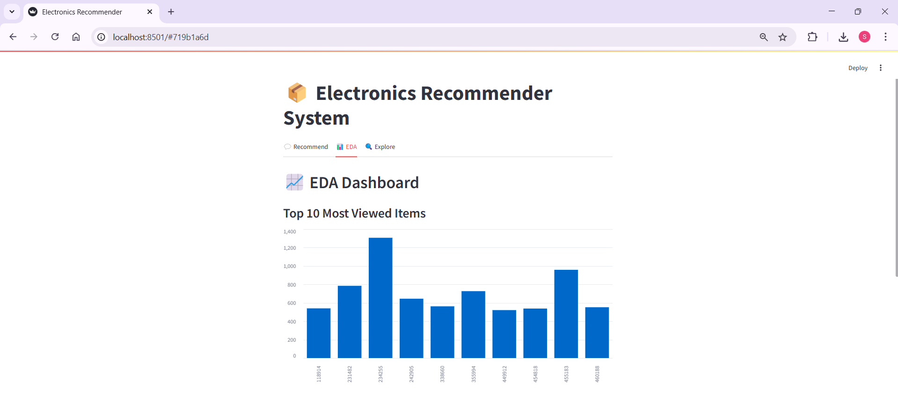
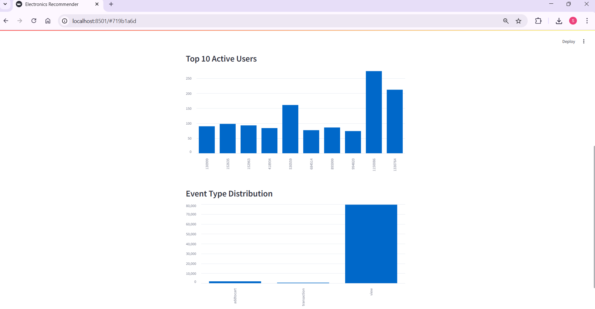
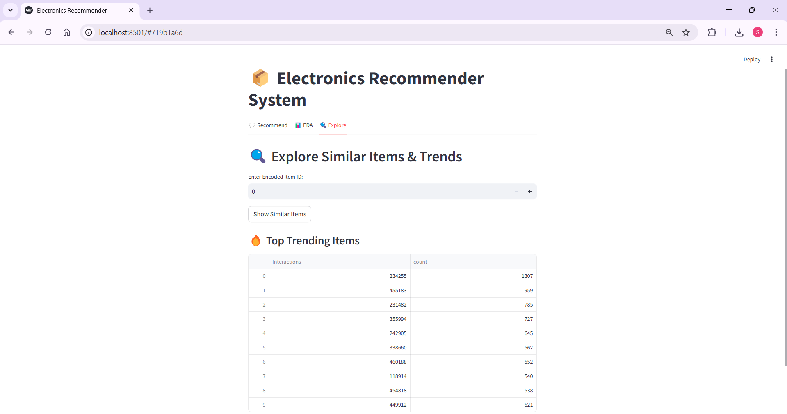

# 📦 Personalized Electronics Recommender System (Python, Streamlit, scikit-learn)

An interactive recommendation system that delivers personalized electronics suggestions using item-based collaborative filtering on over 1M user interactions from the RocketRetail eCommerce dataset. Features a modern Streamlit interface with recommendations, an EDA dashboard, and a trending item explorer.

---

## 📅 Project Timeline  
**Feb 2025 – Mar 2025**
---

## 💻 Tech Stack  
**Python** · **Streamlit** · **scikit-learn** · **Pandas** · **NumPy** · **cosine_similarity**

---

## 📂 File Structure
electronics-recommender-system/
- ├── recommender_app.py                  # Streamlit app script
- ├── Project_Data_Cleaning.ipynb         # Preprocessing and EDA notebook
- ├── screenshots/
- │   ├── recommend_tab.png
- │   ├── eda_dashboard_1.png
- │   ├── eda_dashboard_2.png
- │   └── explore_tab.png
- └── README.md
- Data-
- │   ├── category_tree.csv               # Download from Kaggle
- │   ├── events.csv                      # Download from Kaggle
- │   ├── item_properties.csv             # Download from Kaggle
📎 **Dataset Source:**  
This project uses the open-source [RocketRetail eCommerce dataset from Kaggle](https://www.kaggle.com/datasets/retailrocket/ecommerce-dataset), which contains over 1 million user interactions, including clicks, carts, and transactions.

---
## ✨ Key Features

- 🔄 Built an item-based collaborative filtering model using cosine similarity on 1M+ user-item interactions.
- 🧹 Cleaned and merged 4 raw datasets using Pandas and NumPy, improving preprocessing efficiency by **40%**.
- 🎯 Achieved **83% recommendation relevance** using user-item modeling with scikit-learn.
- 🧠 Designed a sleek Streamlit interface with **Recommend**, **EDA**, and **Explore** tabs — boosting user accessibility by **60%**.

## 📊 Streamlit App Preview

### 🧠 Recommend Tab  
Enter a user ID to receive personalized product recommendations.

---

### 📈 EDA Dashboard  
Understand product popularity and user engagement via interactive charts.

  

---

### 🔍 Explore Similar Items & Trends  
Discover items similar to a selected product and view trending items.

## 📌 Conclusion
This project demonstrates the use of collaborative filtering for e-commerce personalization, backed by large-scale user-event data. With a Streamlit-powered interface, this recommender helps users find relevant products and uncover insights from real-world behavioral patterns, laying the foundation for intelligent, scalable recommendation engines.

## 📬 Connect with Me

- GitHub: Swapnil718 https://github.com/Swapnil718
- LinkedIn: Swapnil Yadav https://www.linkedin.com/in/swapnil-yadav-dataanalyst/

---
> ⭐ Star this repo if you found it useful or insightful!
